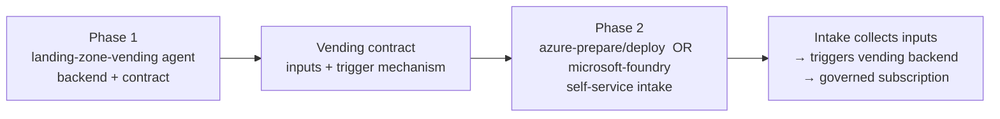

# Scenarios and example usage

End-to-end scenarios that show how to combine the skills and agents in this repository (and the
complementary [Azure Skills Plugin](https://devblogs.microsoft.com/all-things-azure/announcing-the-azure-skills-plugin/))
to deliver a complete outcome. Each scenario lists the goal, which agents/skills to engage, the
order to engage them, and the prompts a Copilot user would type.

> These scenarios are vendor-neutral on implementation detail where it does not matter; where a
> concrete choice helps (Bicep vs Terraform, web vs AI frontend), the trade-offs are called out.

## Scenario 1 — Self-service subscription vending with a request intake

**Goal:** let application teams request a new governed landing zone (subscription) on their own,
and have it provisioned automatically with networking, RBAC, budgets, tags, and policy applied
from creation.

This scenario has two phases. Define the **backend (vending) first** — the contract it produces is
the specification the frontend implements — then build the **self-service intake** that collects
those inputs and triggers the backend.

### Prerequisites

- A governed platform already exists: management group hierarchy, a connectivity hub (hub-spoke or
  vWAN), and a governance/policy baseline. If not, start with the
  [`azure-architect`](../agents/azure-architect.agent.md) and
  [`alz-accelerator-expert`](../agents/alz-accelerator-expert.agent.md) agents.
- A commercial agreement (EA/MCA/CSP) that allows programmatic subscription creation.
- A secretless deployment identity (OIDC / workload identity federation) for the pipeline.
- **For the trigger (both phases):** the **GitHub MCP** server (already declared in this repo's
  [`.vscode/mcp.json`](../.vscode/mcp.json)) lets Copilot create the branch, commit the parameter
  file, and open the pull request that fires the Gitflow vending trigger (Pattern A) — its write
  tools need a GitHub login/token with `repo` scope. For Azure DevOps repos, use the pipeline
  dispatch trigger (Pattern B) instead.
- **For Phase 2 (the intake):** the [Azure Skills Plugin](https://devblogs.microsoft.com/all-things-azure/announcing-the-azure-skills-plugin/)
  (`aka.ms/azure-plugin`, `microsoft/azure-skills`). The `azure-prepare`, `azure-deploy`, and
  `microsoft-foundry` skills referenced below ship in **that** plugin, not in this repository —
  install it separately. Those skills are powered by the **Azure MCP Server** (its README walks
  through setup: Node.js 18+ and `az login`; Microsoft Foundry tooling is part of it). The
  **Microsoft Learn MCP** used for doc grounding is **not** part of the Azure Skills Plugin — in this
  repo it is provided by [`.vscode/mcp.json`](../.vscode/mcp.json) for VS Code Agent mode.

### Phase 1 — define the backend with `landing-zone-vending`

Engage the [`landing-zone-vending`](../agents/landing-zone-vending.agent.md) agent to design the
vending contract and implement it with the `bicep-lz-vending` or `terraform-lz-vending` AVM module.

> Use the `landing-zone-vending` agent. Design a subscription vending contract and implement it with
> `bicep-lz-vending`. Required inputs: workload name, environment, owner, cost center, connectivity
> model. Apply subscription placement, RBAC, budgets, tags, and policy scope at creation.

This phase produces the two things the frontend needs:

1. **Input schema** — the exact fields a requester must provide (the vending contract).
2. **Trigger mechanism** — how a request starts the pipeline, typically either a commit/PR of a
   parameter file to the platform repo (Gitflow pattern) or a pipeline/API dispatch call.

A concrete, reusable draft of both parts — input schema (with JSON Schema and an example payload) and
the two trigger patterns — is in
[`skills/landing-zone-vending/references/vending-contract.md`](../skills/landing-zone-vending/references/vending-contract.md).

The agent's scope ends here: "a request with these inputs, delivered this way, produces a governed
subscription." It can *specify* the intake's interface but does not build the UI.

### Phase 2 — build the self-service intake

Switch agents. The intake's only job is **collect the Phase 1 inputs → fire the Phase 1 trigger.**

**Option A — web portal (Azure Container Apps or App Service):**

> Use the `azure-prepare` skill. Build a Container Apps web app with a form capturing workload,
> environment, owner, cost center, and connectivity model. On submit, open a pull request with the
> lz-vending parameter file (or call the pipeline's dispatch API). Then deploy with `azure-deploy`.

Choose this when you need a custom, branded, multi-step UI; rich form validation; external users;
or tight control over the request workflow.

**Option B — AI intake (Microsoft Foundry agent):**

> Use the `microsoft-foundry` skill. Build a Foundry agent that gathers the vending inputs
> conversationally and calls a tool/action to trigger the vending pipeline (commit the parameter
> file or dispatch the workflow).

Choose this when the interaction is naturally conversational, you want to minimize UI build, and the
intake must *act* (call the pipeline) under a governed managed identity.

**Option C — M365 Copilot front door (later, Teams-native):**

Best as a follow-on once a backend exists and requesters already live in Teams. Triggering a
deployment pipeline from M365 Copilot means building a declarative agent plus a connector/plugin and
involves tenant admin — heavier than A or B for a first build.

### Why this order

The contract from Phase 1 *is the spec* for Phase 2: the web form fields or the AI agent's
tool/function parameters map 1:1 to the vending inputs. Building the intake first means guessing the
schema.

### Skills and agents used

| Phase | Agent / skill | Role |
| :--- | :--- | :--- |
| 1 | [`landing-zone-vending`](../agents/landing-zone-vending.agent.md) | Vending contract + `*-lz-vending` implementation. |
| 1 | [`azure-governance`](../agents/azure-governance.agent.md) | Policy scope new landing zones inherit (if needed). |
| 2A | `azure-prepare` + `azure-deploy` (Azure Skills Plugin) | Web intake on Container Apps / App Service. |
| 2B | `microsoft-foundry` (Azure Skills Plugin) | Conversational AI intake that triggers the pipeline. |

## More scenarios

Additional end-to-end scenarios will be added here. Candidates:

- Greenfield platform build with the ALZ Accelerator (`alz-accelerator-expert`).
- Brownfield adoption of an existing environment into an ALZ (`azure-migration`).
- Policy-as-code rollout with EPAC and AMBA (`azure-governance`).
- Hub-spoke vs Virtual WAN connectivity design (`azure-networking`).

## Related

- Skills index — [`docs/README.skills.md`](README.skills.md)
- Agents index — [`docs/README.agents.md`](README.agents.md)
- Curated link catalog — [`skills/_shared/references/caf-link-catalog.md`](../skills/_shared/references/caf-link-catalog.md)
